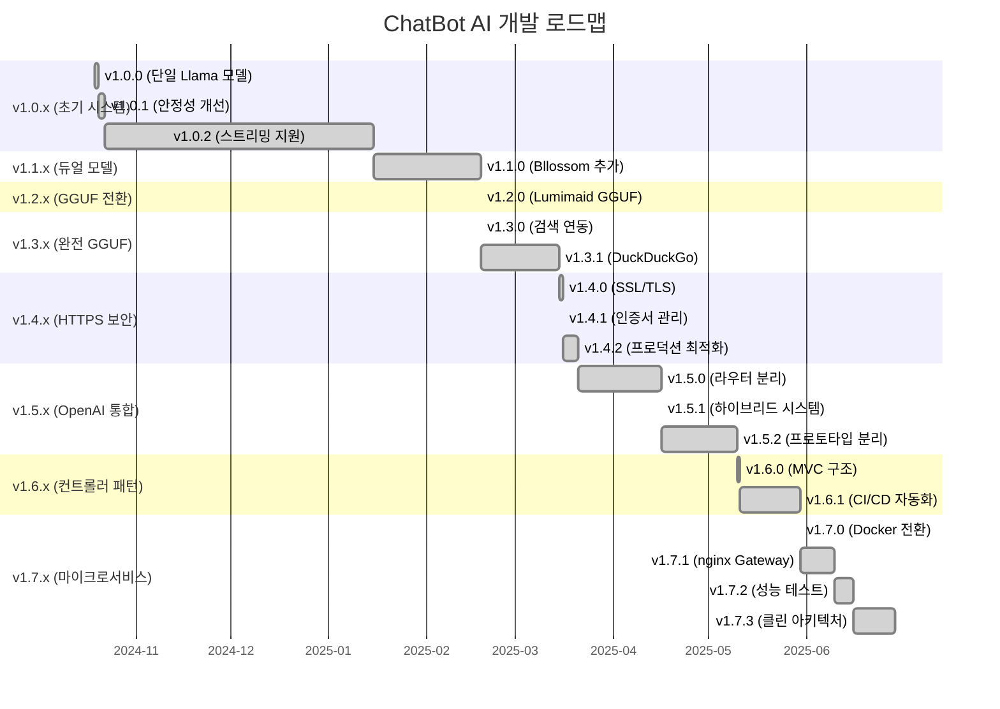

> AI 기반 챗봇 API 프로젝트입니다.  
> FastAPI 기반의 Office/Character API 서버와 Llama 기반 AI 모델을 Docker로 통합 운영합니다.

[github-link](https://github.com/TreeNut-KR/ChatBot-AI)

## 🏗️ 전체 아키텍처

- **office**: 업무용 챗봇 API (FastAPI, 8002)
- **character**: 캐릭터 챗봇 API (FastAPI, 8003)
- **nginx**: API Gateway (8001, reverse proxy, 커스텀 404 지원)
- **python-libs-init**: 공통 Python 라이브러리 볼륨 초기화

## 📋 시스템 아키텍처 다이어그램

## 📋 패키지 다이어그램 
.webp)

## 🌐 API Gateway (nginx) 구조

- **8001 포트**에서 모든 API를 통합 제공
- `/office/` → office 서버(8002)로 프록시
- `/character/` → character 서버(8003)로 프록시
- 존재하지 않는 경로는 `/404.html` 커스텀 페이지 반환

## 📅 개발 로드맵 및 버전 릴리즈 일정

### 간트 차트 (ChatBot AI 버전 릴리즈)

### 주요 마일스톤

| 단계 | 기간 | 주요 성과 | 아키텍처 변화 |
|------|------|-----------|---------------|
| **Phase 1** | 2024.10-2025.01 | 단일 모델 시스템 구축 | Transformers 기반 |
| **Phase 2** | 2025.01-2025.02 | 듀얼 AI 모델 도입 | Llama + Bllossom |
| **Phase 3** | 2025.02-2025.03 | GGUF 완전 전환 | 성능 최적화 |
| **Phase 4** | 2025.03-2025.05 | 보안 및 확장성 | HTTPS + 라우터 |
| **Phase 5** | 2025.05-2025.06 | 마이크로서비스화 | Docker + nginx |

### 개발 통계

- **총 개발 기간**: 8개월 (2024.10 ~ 2025.06)
- **메이저 버전**: 8개 (v1.0.x ~ v1.7.x)
- **릴리즈 횟수**: 18회
- **아키텍처 변경**: 5회 (단일→듀얼→GGUF→라우터→마이크로서비스)

### 📄 v1.0.x

    <a href="/portfolio/reference/chatbot-ai/version(1.0.x).md" class="project-link-card dark">
        <i class="fas fa-external-link-alt project-link-icon"></i>
        명세 상세보기
    </a>

- `First Commit Days` : 2024-10-19 (토) 23:02:45 GMT+0900 (한국 표준시)
- `Last Commit Days` : 2024-12-16 (월) 18:22:23 GMT+0900 (한국 표준시)

### 📄 v1.1.x

    <a href="/portfolio/reference/chatbot-ai/version(1.1.x).md" class="project-link-card dark">
        <i class="fas fa-external-link-alt project-link-icon"></i>
        명세 상세보기
    </a>

- `First Commit Days` : 2025-01-15 (수) 15:40:49 GMT+0900 (한국 표준시)

### 📄 v1.2.x

    <a href="/portfolio/reference/chatbot-ai/version(1.2.x).md" class="project-link-card dark">
        <i class="fas fa-external-link-alt project-link-icon"></i>
        명세 상세보기
    </a>

- `First Commit Days` : 2025-02-18 (화) 10:42:34 GMT+0900 (한국 표준시)

### 📄 v1.3.x

    <a href="/portfolio/reference/chatbot-ai/version(1.3.x).md" class="project-link-card dark">
        <i class="fas fa-external-link-alt project-link-icon"></i>
        명세 상세보기
    </a>

- `First Commit Days` : 2025-02-18 (화) 11:26:36 GMT+0900 (한국 표준시)
- `Last Commit Days` : 2024-03-15 (토) 15:44:49 GMT+0900 (한국 표준시)

### 📄 v1.4.x

    <a href="/portfolio/reference/chatbot-ai/version(1.4.x).md" class="project-link-card dark">
        <i class="fas fa-external-link-alt project-link-icon"></i>
        명세 상세보기
    </a>

- `First Commit Days` : 2024-03-15 (토) 15:47:20 GMT+0900 (한국 표준시)
- `Last Commit Days` : 2024-03-16 (일) 18:24:02 GMT+0900 (한국 표준시)

### 📄 v1.5.x

    <a href="/portfolio/reference/chatbot-ai/version(1.5.x).md" class="project-link-card dark">
        <i class="fas fa-external-link-alt project-link-icon"></i>
        명세 상세보기
    </a>

- `First Commit Days` : 2024-03-21 (금) 15:41:35 GMT+0900 (한국 표준시)
- `Last Commit Days` : 2024-05-03 (토) 18:56:29 GMT+0900 (한국 표준시)

### 📄 v1.6.x

    <a href="/portfolio/reference/chatbot-ai/version(1.6.x).md" class="project-link-card dark">
        <i class="fas fa-external-link-alt project-link-icon"></i>
        명세 상세보기
    </a>

- `First Commit Days` : 2024-05-10 (토) 04:43:23 GMT+0900 (한국 표준시)
- `Last Commit Days` : 2024-05-16 (금) 01:30:44 GMT+0900 (한국 표준시)

### 📄 v1.7.x

    <a href="/portfolio/reference/chatbot-ai/version(1.7.x).md" class="project-link-card dark">
        <i class="fas fa-external-link-alt project-link-icon"></i>
        명세 상세보기
    </a>

- `First Commit Days` : 2024-05-30 (금) 19:19:05 GMT+0900 (한국 표준시)
- `Last Commit Days` : 2024-06-16 (월) 16:36:43 GMT+0900 (한국 표준시)
